# Process Transcript

1. Convert from VTT format to text, preserving the names so the LLM can refer to the participants by their names.
2. `python excerpt-notes.py -txt <transcript file> -np excerpt-notes-prompt.txt`
   This produces a file with a name schema: `notes-sim-<similarity threshold>--<LLM model name>-<year>-<month>-<day>-<time>.csv`, as exported from a Pandas DataFrame.
3. `python style.py -txt <transcript file> -p style-prompt.txt`
   This produces a file with a name schema: `style-<model name>-<year>-<month>-<day>-<time>.txt`, however the LLM generates it.
5. `python storify-notes.py -n <notes file> -sp storify-notes-prompt.txt -st <linguistic style file>`
   This generates `lpestory--<model name>-<year>-<month>-<day>-<time>.txt`

# V3 Workflow with Participant Rewrite

```mermaid
graph LR
    Transcript[/"Transcript"\]
    ParticipantRewrite[/"Participant Rewrite"\]
    Chunking["Chunking"]
    Sum((" "))
    TakeNotes["Take Notes"]
    NotesPrompt[/"📝 Notes Prompt"\]
    Notes[/"📝 Notes"\]
    RefinePrompt[/"Refine Story Prompt"\]
    ReviseAdd["Revise & Add New Info"]
    NewStory[/"New LPE Story"\]
    
    Transcript --> Chunking
    ParticipantRewrite --> Sum
    Chunking --> Sum
    Sum --> TakeNotes
    NotesPrompt --> TakeNotes
    TakeNotes --> Notes
    Notes --> ReviseAdd
    RefinePrompt --> ReviseAdd
    ReviseAdd --> NewStory
```

